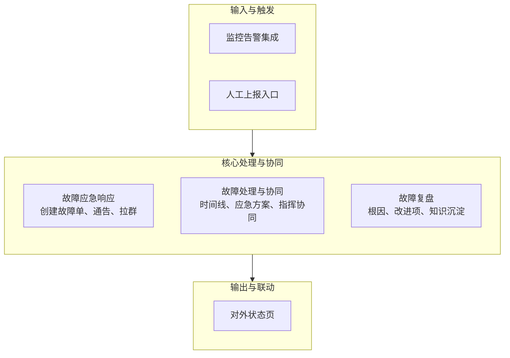

# IT故障管理系统功能设计方案

## 1. 设计理念与核心思想

本方案遵循“**事中高效应急，事后彻底复盘**”的原则，核心是实现故障管理的**闭环化**、**流程化**和**数据化**。借鉴阿里云OIC“事件”与“故障”分离的理念：

- **事件**： 单个服务的自动告警，是潜在的故障线索。
- **故障**： 已确认的、对业务产生显著影响的异常状态，由**一个或多个关联事件**构成，需要人工介入和流程跟踪。

## 2. 功能模块总览

整套功能应包含以下核心模块，其工作流与交互逻辑如下所示：

## 3. 核心功能模块详细设计

### 模块一：故障全生命周期管理（故障单）

这是系统的核心，用于跟踪一次故障从发生到关闭的全过程。

| 字段/功能 | 设计说明 |
| :--- | :--- |
| **故障ID** | 唯一标识符，如 `F-20240520-001` |
| **故障标题** | 简明扼要概述故障，如 `电商核心下单接口大面积超时` |
| **故障状态** | **待确认 -> 处理中 -> 已恢复 -> 待复盘 -> 已关闭** （核心状态流） |
| **故障等级** | **P1/P2/P3/P4**（根据预定义的影响范围、持续时长等SLO自动或手动定级） |
| **关联事件** | **自动关联**： 可一键关联触发故障的监控告警事件。 **手动关联**： 可手动添加相关的事件ID，形成事件集群。 |
| **影响范围** | 下拉选择：**服务目录**（如：订单服务、支付服务）
| **处理时间线** | **自动记录**： 关键状态变更的时间点（创建、恢复、关闭）。 **手动记录**： 处理人员可手动添加关键操作和发现，形成清晰的故障处理叙事。 |
| **根因分析** | 复盘阶段填写。提供结构化模板：**问题根因**、**触发条件**、**改进措施**。 |
| **改进措施** | 复盘后产生的Action Item列表，可关联到Jira等项目管理工具，并跟踪状态（待处理、进行中、已完成）。 |

### 模块二：故障应急响应

**目标**： 在故障发生时，快速组织资源、同步信息。

| 功能点 | 设计说明 |
| :--- | :--- |
| **一键创建应急群** | 系统自动根据故障影响的服务，第一时间将通知影响服务的运维、开发、产品负责人，并拉取相关运维、开发、产品负责人，并生成群聊，将故障信息自动推送至群内。 |
| **通告模板** | 提供预置的Markdown通告模板，支持一键生成并发布到内部通讯工具（短信/电话语音/邮箱/Webhook）。 |
| **应急指挥** | 在故障单中可明确指定**故障处理指挥官（Incident Commander）**，由其统一指挥和决策，避免混乱。 |
| **状态同步** | 处理人员可在时间线中@相关人员，系统自动将更新内容同步至应急群。 |

### 模块三：故障复盘（Postmortem）管理

**目标**： 确保每个P1/P2故障都必须复盘，并将经验转化为行动。

| 功能点 | 设计说明 |
| :--- | :--- |
| **复盘会议管理** | 可设置复盘会议时间、邀请参会人、关联故障单。 |
| **复盘报告模板** | 提供结构化的复盘模板： 1. **故障概述**（时间、时长、影响） 2. **处理时间线**（详细时间线） 3. **根因分析**（深层原因） 4. **改进措施**（5W1H：做什么、谁负责、何时完成） 5. **经验教训** |
| **改进措施跟踪** | 改进措施自动生成待办任务，并分配给责任人，系统跟踪其完成状态，直至闭环。 |

### 模块四：系统集成与联动

**目标**： 故障管理不是孤岛，必须与现有工具链打通。

| 集成对象 | 集成方式与 benefit |
| :--- | :--- |
| **监控系统** | **双向集成**： - 监控告警自动创建/关联故障单。 - 故障单状态变化可回调监控系统，触发告警静默或状态更新。 |
| **通知渠道** | **多渠道通知**： 支持通过钉钉、飞书、企业微信、短信、电话等渠道发送故障状态更新。 